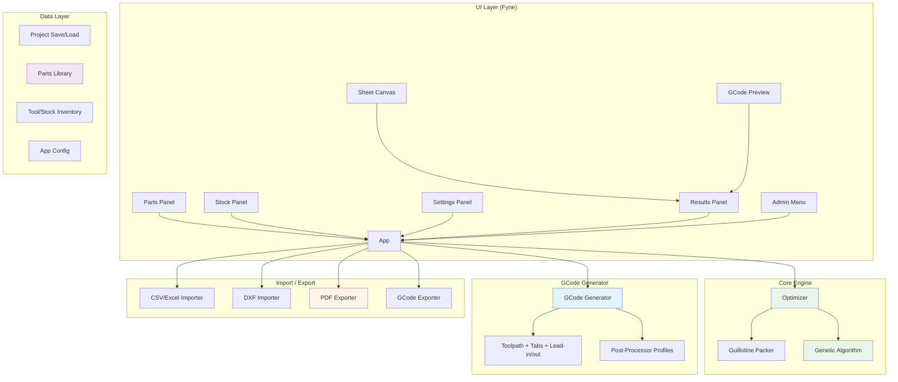

# CNCCalculator - Claude Instructions

Project-specific instructions for CNCCalculator development.

## Project Overview

CNCCalculator is a cross-platform desktop CNC cut list optimizer built with Go and Fyne. It generates optimized 2D rectangular cutting layouts and exports GCode for CNC machines.

**Tech Stack:**
- Go 1.22+
- Fyne v2.5.4 (cross-platform GUI)
- Single binary distribution, no runtime dependencies

## Documentation (MANDATORY)

**Every code change MUST include documentation updates.** This is enforced by CI.

### What to Update

| Change Type | Update Required |
|-------------|----------------|
| New feature | README.md features list, CLAUDE.md if architecture changes |
| New package/file | README.md project structure, CLAUDE.md code location |
| API/model change | CLAUDE.md architecture diagram if applicable |
| New menu item | README.md features list |
| New dependency | go.mod (automatic), README.md prerequisites if system dep |
| Workflow change | CLAUDE.md workflow section |

### Rules
- **README.md** is the user-facing project documentation — keep features list and project structure current
- **CLAUDE.md** is the developer/AI instructions — keep code location, architecture, and workflow current
- **CI will check** that PRs touching Go files also touch at least one of README.md or CLAUDE.md
- When in doubt, update both

## Code Location

```
github.com/piwi3910/cnc-calculator/
├── cmd/cnc-calculator/     # Entry point (main.go)
├── internal/
│   ├── model/              # Core types + inventory/library/config types
│   ├── engine/             # Guillotine packer + genetic algorithm optimizer
│   ├── gcode/              # GCode generator + parser (for preview)
│   ├── importer/           # CSV/Excel/DXF import
│   ├── export/             # PDF export
│   ├── ui/                 # Main Fyne UI, dialogs, admin, profile editor
│   │   └── widgets/        # Custom Fyne widgets (SheetCanvas, GCodePreview)
│   └── project/            # Project/profile/inventory/library/config persistence
├── .github/workflows/      # CI pipeline
├── go.mod
└── Makefile
```

## Git Workflow (MANDATORY)

### Always Use Git Worktrees

**NEVER use `git checkout -b` or `git switch -c` in the main worktree.** The main worktree MUST always stay on `main`. All feature development, bug fixes, and PRs use isolated git worktrees.

### Worktree Directory

All worktrees live in `../cnc-calculator-worktrees/` (sibling to this repo).

### Commands

```bash
# Create a worktree for a new feature/fix (from main worktree)
git fetch origin
git worktree add ../cnc-calculator-worktrees/issue-NUM-description -b issue-NUM-description origin/main

# Work inside the worktree
cd ../cnc-calculator-worktrees/issue-NUM-description

# Push and create PR from the worktree
git push -u origin issue-NUM-description
gh pr create --title "..." --body "..."

# Cleanup after merge (from main worktree)
git worktree remove ../cnc-calculator-worktrees/issue-NUM-description
git branch -d issue-NUM-description
```

### Branch Naming

```
issue-NUM-brief-description
```

Examples: `issue-42-fix-login-auth`, `issue-15-add-export-feature`

### Rules

- **One branch per issue** — each in its own worktree
- **Main worktree stays on `main`** — ALWAYS, no exceptions
- **Worktree directory name matches the branch name**
- **Never have two agents working in the same worktree**
- **Clean up worktrees and delete branches after merging**
- **All PRs are created from worktree branches, never from main**
- **Always `git fetch origin` before creating a worktree** to ensure you branch from latest main

## Architecture



## Development Commands

```bash
# Run
make run  # or: go run ./cmd/cnc-calculator

# Build
make build  # or: go build -o cnc-calculator ./cmd/cnc-calculator

# Test
make test  # or: go test ./...

# Cross-compile
make windows        # Windows .exe
make darwin-arm64   # macOS Apple Silicon
make darwin-amd64   # macOS Intel
make linux          # Linux binary

# Package with fyne-cross (requires: go install github.com/fyne-io/fyne-cross@latest)
make package-windows
make package-darwin
```

## Code Style

### Go Conventions
- Standard Go formatting: `gofmt -w .`
- Package comments at top of files
- Exported functions have documentation
- JSON tags use `snake_case`
- Errors returned, wrapped where useful

### Fyne-Specific Patterns
- Custom widgets extend `widget.BaseWidget`
- Implement `CreateRenderer()` for custom rendering
- Use `container.NewVBox()`, `container.NewGridWithColumns()` for layouts
- Dialogs: `dialog.NewForm()`, `dialog.ShowInformation()`, `dialog.ShowError()`

### Type Design
- Value types for small data (`Part`, `StockSheet`)
- Pointers for optional/large data (`*OptimizeResult`)
- Enums as `int` constants with `String()` method (e.g., `Grain`)

## Testing

```bash
# Run all tests
go test ./...

# With coverage
go test -cover ./...

# Specific package
go test ./internal/engine
```

## Module Information

- **Module**: `github.com/piwi3910/cnc-calculator`
- **Main package**: `cmd/cnc-calculator`
- **Internal packages**: `model`, `engine`, `gcode`, `importer`, `export`, `ui`, `project`
