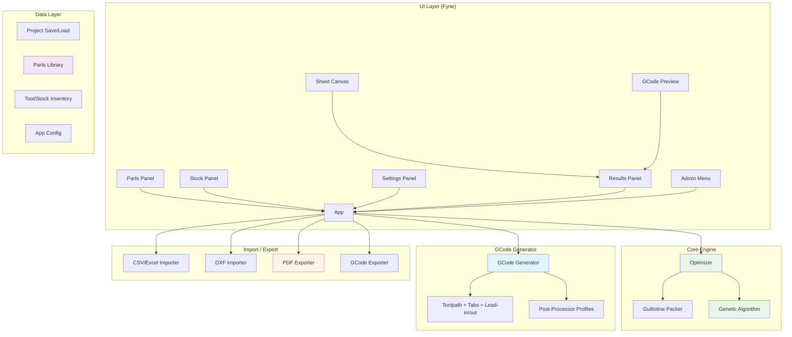

<p align="center"></p>

# SlabCut

A cross-platform desktop application for optimizing rectangular cut lists and generating CNC-ready GCode. Built with Go and [Fyne](https://fyne.io/) — produces a single native binary for Windows, macOS, and Linux with no runtime dependencies.

## Features

### Optimization Engine
- **2D Bin Packing** — Guillotine-based optimization with Best Area Fit heuristic
- **Genetic Algorithm** — Alternative optimizer using population-based meta-heuristic for better packing efficiency
- **Grain Direction** — Supports horizontal/vertical grain constraints on both parts and stock sheets with automatic grain matching
- **Saw Kerf & Edge Trim** — Accounts for blade width and stock edge waste
- **Part Rotation** — Automatically rotates parts for better fit (respects grain)
- **Multiple Stock Sizes** — Use different stock sheet sizes in one run with smart selection (trial-packing heuristic)

### CNC & GCode
- **GCode Export** — Full CNC toolpath generation with:
  - Multi-pass depth stepping
  - Configurable feed/plunge rates and spindle speed
  - Holding tabs to prevent part movement
  - Tool radius compensation (outside cut)
  - Safe Z retract between operations
  - Lead-in/lead-out arcs for smoother entry and exit
- **GCode Preview** — Visual toolpath simulation with color-coded rapid/feed/plunge moves
- **Post-Processor Profiles** — Built-in profiles for Grbl, Mach3, LinuxCNC + custom user profiles
- **DXF Part Outlines** — GCode follows actual part contours for non-rectangular shapes

### Import & Export
- **CSV Import** — Auto-detect delimiters (comma, semicolon, tab, pipe) and column mapping
- **Excel Import** — Read .xlsx files with auto header detection
- **DXF Import** — Import non-rectangular parts from DXF files (LWPOLYLINE, LINE, ARC, CIRCLE)
- **PDF Export** — Multi-page cut diagrams with dimensions, labels, efficiency stats, and summary
- **GCode Export** — Per-sheet GCode files with configurable profiles
- **Project Save/Load** — JSON-based project files (`.cnccalc`)

### User Interface
- **Visual Layout** — Color-coded sheet diagrams showing part placements and stock tab zones
- **Undo/Redo** — Full history with Ctrl+Z / Ctrl+Y (Cmd+Z / Cmd+Shift+Z on macOS)
- **Parts Library** — Save and reuse predefined parts organized by category
- **Tool & Stock Inventory** — Manage cutting tools and stock sheet presets
- **Admin Menu** — Application settings, inventory management, data backup/restore
- **Stock Size Presets** — Quick-select dropdown with common panel sizes (Full, Half, Quarter sheet, Euro sizes)

## Prerequisites

- Go 1.22+
- C compiler (GCC/MinGW on Windows, Xcode CLI tools on macOS)
  - Required by Fyne for CGo graphics bindings
- On Linux: `sudo apt install libgl1-mesa-dev xorg-dev` (for OpenGL)

## Build

```bash
# Run directly
make run

# Build for current platform
make build

# Cross-compile
make windows        # produces slabcut.exe
make darwin-arm64   # produces slabcut-darwin-arm64 (Apple Silicon)
make darwin-amd64   # produces slabcut-darwin-amd64 (Intel Mac)
make linux          # produces slabcut-linux
```

### Packaged Builds (recommended for distribution)

Uses [fyne-cross](https://github.com/fyne-io/fyne-cross) for proper `.exe`/`.app` bundles:

```bash
go install github.com/fyne-io/fyne-cross@latest

make package-windows   # Windows .exe with icon
make package-darwin    # macOS .app bundle (universal binary)
```

## Run Tests

```bash
make test
```

## Project Structure

```
SlabCut/
├── cmd/slabcut/
│   └── main.go                 # Entry point
├── internal/
│   ├── model/
│   │   ├── model.go            # Core types (Part, StockSheet, Placement, etc.)
│   │   ├── inventory.go        # Tool/stock inventory types
│   │   ├── library.go          # Parts library types
│   │   └── appconfig.go        # Application configuration
│   ├── engine/
│   │   ├── optimizer.go        # Guillotine bin-packing algorithm
│   │   └── genetic.go          # Genetic algorithm optimizer
│   ├── gcode/
│   │   ├── generator.go        # GCode toolpath generation
│   │   └── parser.go           # GCode parser for preview
│   ├── importer/
│   │   ├── importer.go         # CSV/Excel import with auto-detection
│   │   └── dxf.go              # DXF file import
│   ├── export/
│   │   └── pdf.go              # PDF export of cut diagrams
│   ├── project/
│   │   ├── project.go          # Save/load project files
│   │   ├── profiles.go         # Custom GCode profile persistence
│   │   ├── inventory.go        # Tool/stock inventory persistence
│   │   ├── library.go          # Parts library persistence
│   │   └── appconfig.go        # App config persistence
│   └── ui/
│       ├── app.go              # Main UI (tabs, menus, dialogs)
│       ├── history.go          # Undo/redo history manager
│       ├── inventory.go        # Inventory management dialogs
│       ├── library.go          # Parts library dialogs
│       ├── admin.go            # Admin menu and settings
│       ├── profile_editor.go   # GCode profile editor
│       └── widgets/
│           ├── sheet_canvas.go    # Visual sheet layout renderer
│           └── gcode_preview.go   # GCode toolpath preview
├── .github/workflows/
│   └── ci.yml                  # CI: build, test, lint, docs check
├── go.mod
├── Makefile
├── CLAUDE.md
└── README.md
```

## Architecture



## Contributing

1. Create a GitHub issue describing the change
2. Create a feature branch: `issue-NUM-description`
3. Implement with tests
4. Update README.md and CLAUDE.md if your changes affect features, architecture, or workflow
5. Create a PR referencing the issue

## License

MIT
